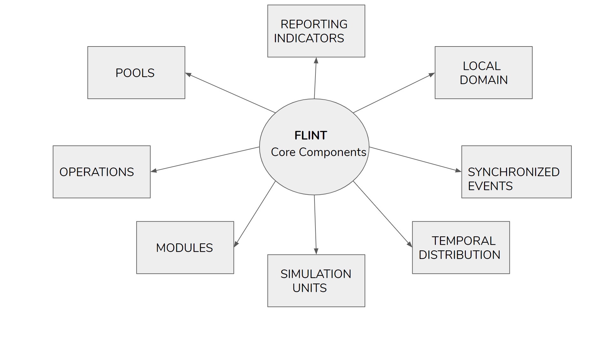

**Welcome to the Full Land Integration Tool!**

The FLINT is a fully modular system that allows users to integrate carbon and other models with remote sensing data to produce greenhouse gas accounts for the land sector.
Currently this Wiki is the main source of information on FLINT and how it works. It aims to support developers, early implementers and power users by providing a detailed description of system operation.

The overall framework will be based on the simulation of events and processes. Modules with variable time steps can therefore be accommodated. Key elements of the framework will include the overall integration module, a transaction service, and individual modules that are easily exchanged and modified, and that each serve key functions such as representation of growth, decomposition, disturbances, forest management actions and so on. Other key elements such as the management of the events stream, the data platform and results processing capabilities will be described elsewhere.

This document set provides a high-level overview of the FLINT system and its core components. Including:

* Pools
* Operations
* Modules
* Simulation Units
* Local Domain
* Synchronized Events
* Temporal Distribution
* Reporting Indicators

