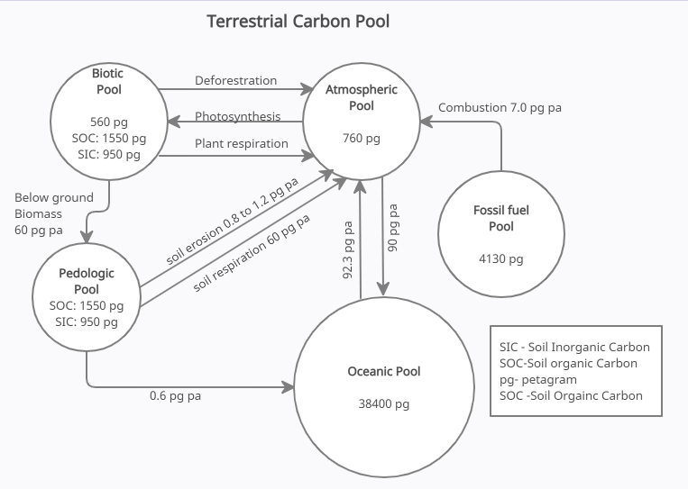

**What is a pool?**

A pool is a reservoir within which something can be stored and released. For example, a carbon pool is a reservoir from which carbon can be stored (sequestered and/or maintained) or emitted, such as debris. Within FLINT, each pool is attributed a value, for example tonnes carbon, and at each time step the FLINT can move stores from one pool to another using operations.

Here a picture that visualizes the carbon pool and how carbon stock flows from one pool to another

**How are pools used in FLINT?**

FLINT is able to be configured for sub-regional, regional and national circumstances, while complying with the pool definitions of the IPCC (aboveground biomass, belowground biomass, deadwood, litter, soil (mineral and organic). To achieve this, the FLINT calculates stock and fluxes for sub-pools, which can then be aggregated up to the IPCC pools, as well as non-IPCC pools such as atmosphere and products. Default sub-pools will be set in the FLINT using default configurations that hook the FLINT to default modules (Table 1).  This flexible approach will enable the implementation in the FLINT of pool structures used in existing national approaches, while also allowing for future developments of adding new pools (e.g. mosses, bamboo, or explicit representation of specific pools such as stumps or bark). Development of vertical soil structures, e.g. for the representation of water balance or active layers in peatlands or permafrost systems will also be possible.
FLINT will maintain a hierarchy of pools/sub-pools and manage their interactions, for both Carbon & Non-carbon pools (the main pool layer). As these interactions (stocks and flows) will vary by species, it is necessary to track the outputs of attributed to specific species through the system. To manage this, FLINT will also duplicate the simulations for each species (both Tree and Crop) used during the simulation, creating species specific pool/sub-pool layers.

