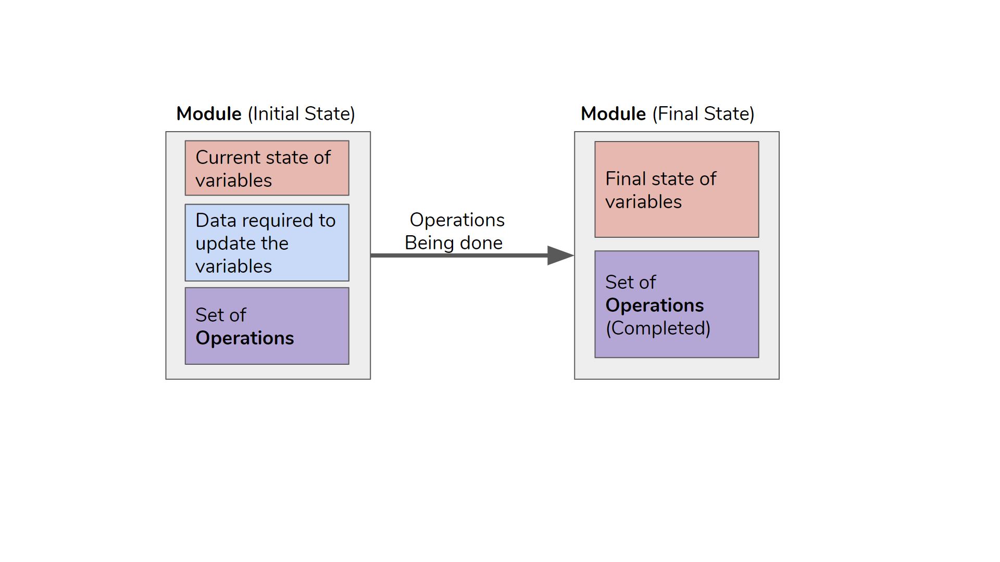
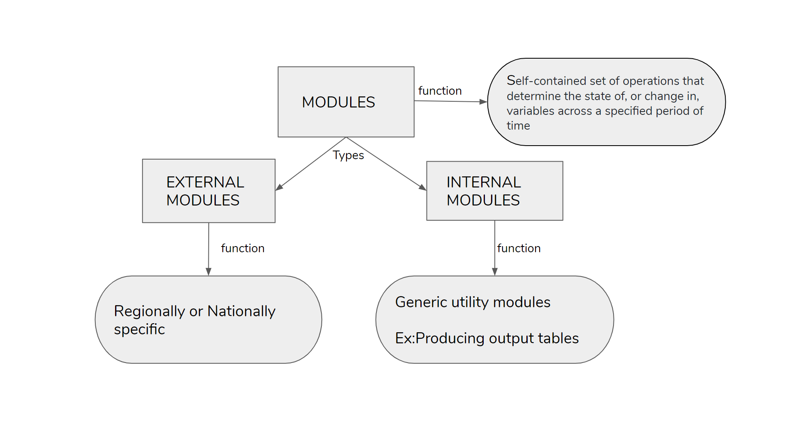
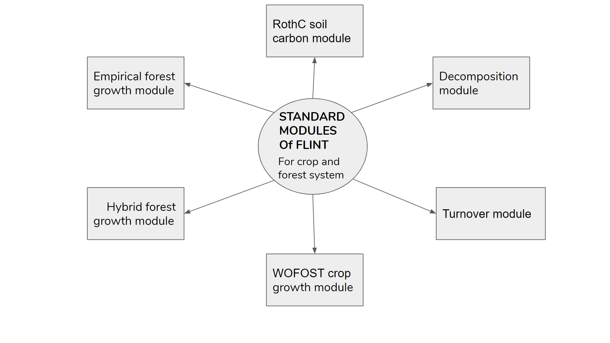

**What is a module?**

A module is a self-contained set of operations that determine the state of, or change in, variables across a specified period of time for a single Simulation Unit in direct response to event notifications from the FLINT core system (Unit Controller). For example, the empirical forest growth module includes all the operations required to simulate biomass accumulation.

**How do modules operate?**

Each module reads (or is provided with – see Unit Controller) information about the current state variables and the data required to update the state variables, such as climate data or information about disturbances to simulate. Each module then performs the required calculations and returns information about the updates to apply to each of the state variables and C pools. For state variables such as age or height it is possible for modules to return the updated value but for all carbon pools and other fluxes the module returns an array (sparse matrix) of the proposed operations. This array will include the information about the source pool, the sink pool, and the amount (Mg ha-1 per time step) of the flux. Module-specific metadata regarding units and time step size are also required. This information is all returned to the Unit Controller.

In terms of the FLINT programming framework, there are internal and external modules. The internal modules tend to be generic utility modules, for example, for producing output tables. While external modules are regionally or nationally specific. By using modules and separating the generic and specific, FLINT’s framework remains highly flexible and new modules can be ‘plugged in’ as they are developed.
Standard modules in FLINT 
 

The FLINT includes six standard modules for simulating changes in forest and crop systems, including changes in soil carbon. These modules each run for all simulations at a monthly step interval (see Temporal Distribution), and include:
* Empirical forest growth module
* Hybrid forest growth module
* WOFOST crop growth module
* Turnover module
* Decomposition module
* RothC soil carbon module

**Modules for disturbance events**

Disturbance events are events that occur intermittently (rather than for every time step in a simulation) and affect carbon stocks. Disturbance events include natural and anthropogenic events, including fire, harvesting, ploughing, and fertiliser application (Table 2).   While disturbance events are modules within FLINT, they are referred to separately as they are not run on every simulation as are the aforementioned modules.
FLINT can use tabular or spatial data to account for disturbance events. As a minimum FLINT needs the date of the disturbance, and the disturbance type. Where tabular data is used, information is also needed for the amount (or proportion) affected, the units the disturbance event is reported in (area, carbon etc.), and any eligibility criteria (i.e. Simulation Unit characteristics that the event is allowed to affect). This information can be used to attribute the disturbance event to Simulation Units using a pre-determined criteria (e.g. randomly, weighted, or based on a unit characteristic).

The follow is a disturbance events included in FLINT. Carbon pool events are those that directly affect one or more carbon pool, while non-carbon pool events indirectly affect one or more non-carbon pool.

**Carbon pool events**

* Fire
* Harvest
* Herbicide
* Plough
* Debris mulching
* Grazing
* Organic matter additions
* Planting

**Non-Carbon Events**
* Irrigation
* Fertilizer application
* Compaction
