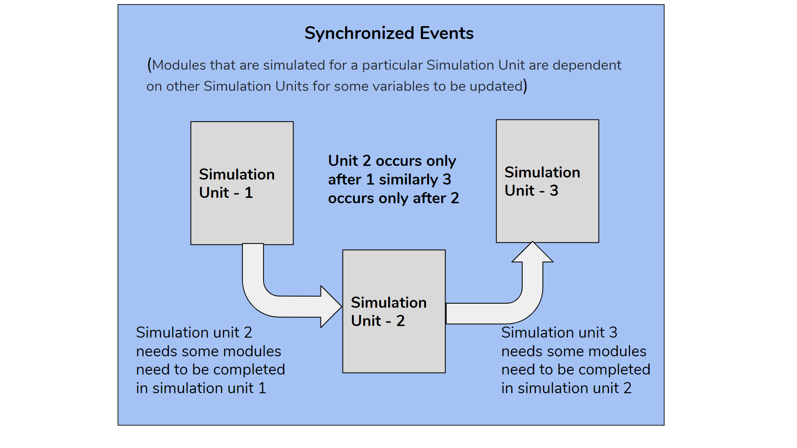

**What are synchronised events?**

In some circumstances, modules that are simulated for a particular Simulation Unit are dependent on other Simulation Units. That is, there is an interdependency across the Simulation Units. In these situations, it is necessary for there to be a process that synchronises across the related Simulation Units. For example, where it is known that 1,000 of 10,000 pixels were affected by a fire event, in order to determine if a pixel should apply a fire module, it is necessary to know how many other pixels have been selected to have the fire module applied.  

 
**How are synchronised events handled in FLINT?**

Included in the FLINT is a synchronised server. This server uses a set of user-inputted criteria to identify particular Simulation Units for which a module will, or could, be applied. The module can be applied to all Simulation Units that meet the criteria, or the module can be attributed to a sub-set of the identified Simulation Units using a pre-determined criteria (e.g. randomly, weighted, or based on a unit characteristic). Once identified, the module is run and the outputs computed. Notably, this is carried out during the simulation.
For example, where a disturbance event has occurred and only aspatial tabular data is available, the simulation process is run to identify Simulation Units that meet the criteria of the stated disturbance event. This criteria may be characteristics such as forest age, species, or region. Once identified, FLINT will run a disturbance module on the simulations that meet the criteria up until the effect of the disturbance event has been modelled (e.g. the same area or carbon loss as the disturbance event).
Other systems, such as Australia’s Full Carbon Accounting Model, do not have this ability to apply tabulated spatial data during a simulation. Rather, the data must be processed separate from the model before it can be applied.
